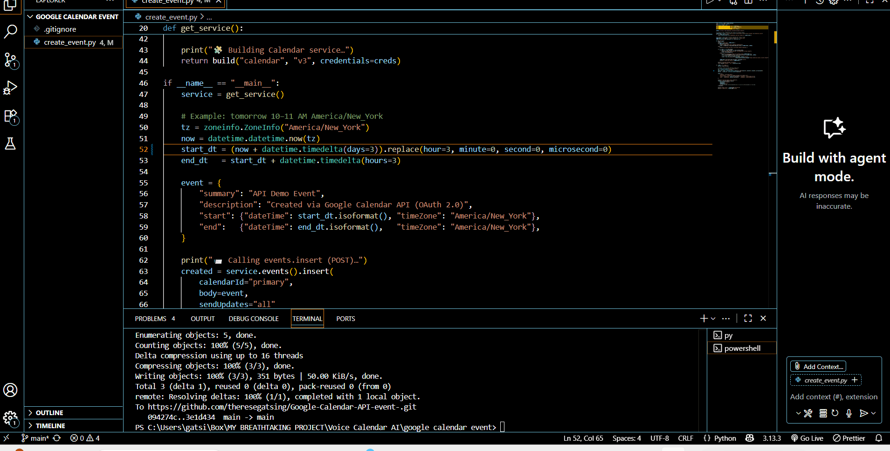

# Google Calendar Event Creator (Python + OAuth 2.0)

Create Google Calendar events from a Python script using OAuth 2.0 user consent.  
**No secrets in Git** — keep `credentials.json` and `token.json` local.

## Demo
**Video walkthrough:** 

## Quick setup
1) In Google Cloud Console: create/select a project → **Enable** “Google Calendar API”.  
2) **OAuth consent screen:** User type **External**, add yourself as a **Test user**.  
3) **Credentials → OAuth client ID → Desktop app** → download `credentials.json` (don’t commit).  

## Install
```bash
python -m pip install google-api-python-client google-auth-oauthlib google-auth-httplib2 tzdata
